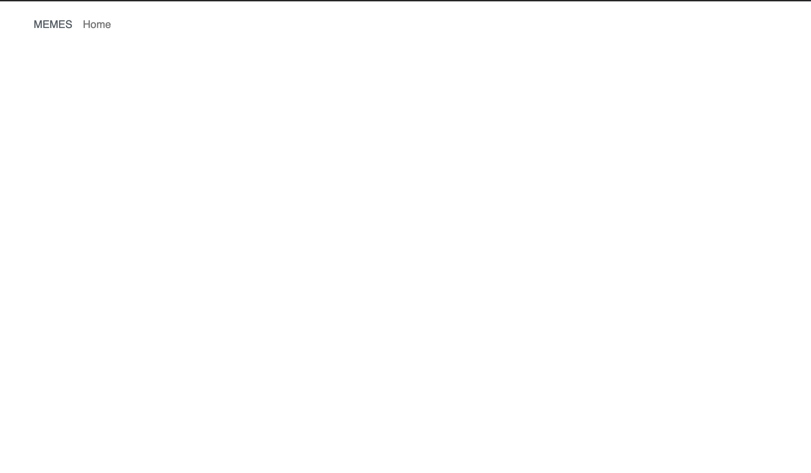
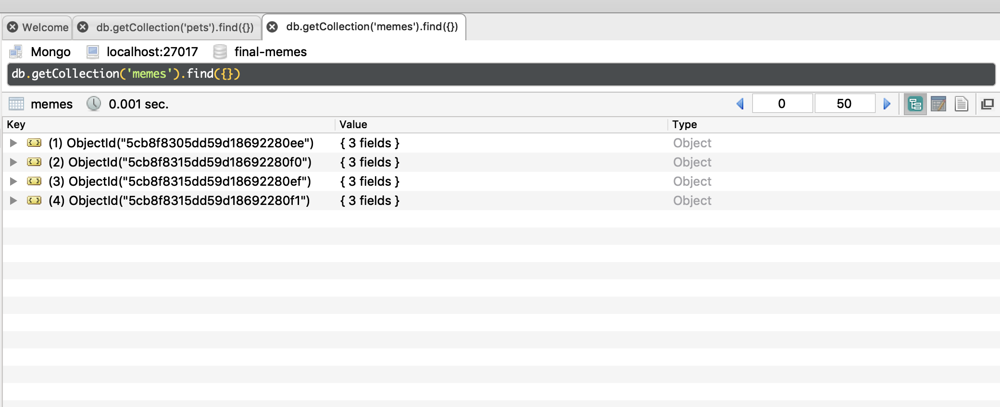

# Memes

This problem focuses on the Vue CLI.

## Overview of the Application

The Memes app is a simple application for displaying memes. To
run this code, you will need to get the back end running in one terminal:

```
cd back-end
npm install
node server.js
```

Then get the front end running in another terminal:

```
cd front-end
npm install
npm run serve
```

You can visit the app in your browser at `localhost:8080`.

When you start up the application,
it should look like this;



## Database Schema and Model

The database has one model, Meme, whose schema consists of:

- path: a string, the path to the image
- created: a date, set to now as the default

## REST API

The REST API implemented by the server consists of the following:

- GET /api/memes
  - gets all memes entries, sorted by their path


- GET /api/memes/:id
  - gets a single meme, given in the "id" portion of the URL


- POST /api/memes
  - creates a new meme
  - the body must contain formData, with a "meme" property that is a file

## Data

I have provided some sample data to load into the database in `back-end/data.js`. Be sure your database is running and the Node server is running. Then, run the following
command:

`node data.js`

You can verify this data is loaded with RoboMongo:



## Tasks

Use the Vue CLI to build the front end for the application, including a home page, a meme page, and an upload page

- The home page should display all memes. They should be displayed in some sort of
  grid, but use your imagination to make it look nice.

- When you click on the image for a meme, the application should display a
  separate page for this meme. When you reload the page, that same meme should
  be displayed. The URL for this page should be `/meme/ID`, where `ID` is
  the ObjectId of that meme in the database.

- Add a page for uploading a meme. This should display a form that can be used to upload a meme, which includes just an image. The created date is set by the back end. You can leave the form on the page at all times. You do not need to show a thumbnail before the image is uploaded, but you're welcome to if you know how to do this.

- All pages should have reasonably good styling, following the web design
  guidelines discussed in class. This includes the menu. You do not need to worry about responsive design. As a hint for a color scheme, upload a nice photo to [Canva](https://www.canva.com/colors/color-palette-generator/) and you can get a good scheme (you don't have to use all colors).

- See the main README for screenshots required.

The last image uploaded with the sample data is my message to you at the end of this semester. :-)

Please upload one funny meme of your own for use in screenshots. Make me laugh!

## Grading

This problem is worth 75 points. Grading will be based on this rubric:

| Item      | Points    |
| --------- | --------- |
| Home Page | 25 points  |
| Meme Page | 25 points |
| Upload Page | 25 points |

Partial Credit for each part: 50% if solid effort but not close to working, 80%
if solid effort and close to working.

Style will be given as 10 extra credit points, graded based on:

* white space
* visual hierarchy
* navigation
* color
* typography

You can review [the web design principles](http://web-design.chiamo.org/) to get an idea of what I'm looking for.
