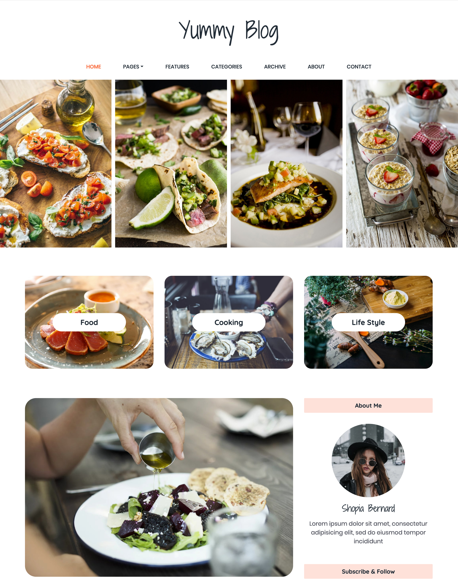

# Recipes

This problem focuses on CSS.

Imagine you are working as a web developer, and a client has asked you to develop a new recipe website for her. Your friend at your company is the web designer, and they have created this design for the client:



## Task

Your manager wants you to code a plain HTML and CSS prototype for the website to show the client you can replicate this look. You do not need to make any links or make any buttons clickable. You do not need to make the site responsive.

**You may not use Google to find a website with this design and then inspect or copy its styles. You need to do this on your own.**

See the main README for screenshots required.

## Resources

Your friend has also provided you with the following:

* All the necessary images in the [images](./images) directory.

* Google fonts to use: [Shadows Into Light Two](https://fonts.google.com/specimen/Shadows+Into+Light+Two?selection.family=Shadows+Into+Light+Two&sidebar.open) for the blog title and author name, [Poppins](https://fonts.google.com/specimen/Poppins?selection.family=Shadows+Into+Light+Two&sidebar.open&query=poppin) for the menu, and [Quicksand](https://fonts.google.com/specimen/Quicksand?selection.family=Shadows+Into+Light+Two&sidebar.open&query=quicksand) for the button text and everything else in the body of the site.

* Colors to use: #FC6C3F for orange highlights and #FEE2D9 for very light orange.


Some things you remember from your web programming experience:

* You can use Font Awesome for the [dropdown](https://fontawesome.com/icons/caret-down?style=solid) icon in a menu.

* Flexbox is great for laying out a row of items from left-to-right and from top-to-bottom.

* You can use Google to [find out how to place a button on an image](https://www.w3schools.com/howto/howto_css_button_on_image.asp).

* You can use Google to find out how to make rounded corners for images and divs.

* You can use any of your past experience or past code for hints.

## Testing

You should be able to develop your code locally with your own code editor and test it using:

```
python3 -m http.server
```

Alternatively, for Python 2:

```
python -m SimpleHTTPServer
```

## Grading

This problem is worth 50 points.

| Item      | Grade     |
| --------- | --------- |
| Title     | 10 points |
| Menu      | 10 points |
| Top images| 10 points |
| Middle images and buttons      | 10 points |
| Bottom layout | 10 points |

You will get 10 points for each part that looks very close to the design. You will get  7 or 8 or 9 points for getting close, depending on how close it is, and 5 points for having a layout that is far off but shows effort.
