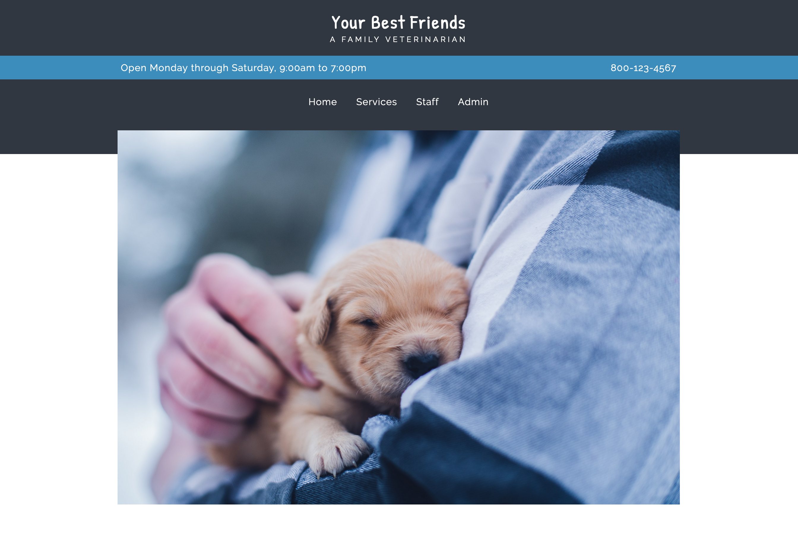
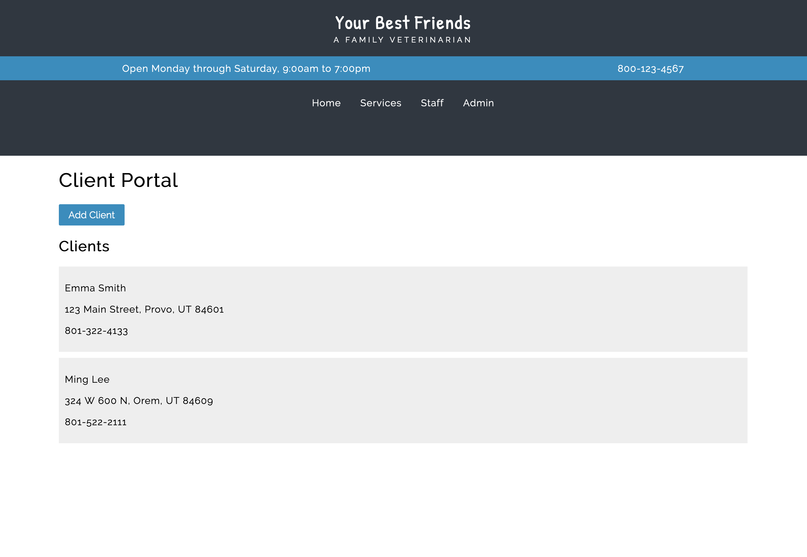
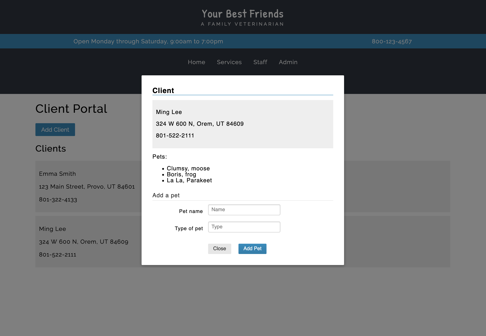

# Vet

This problem focuses on using Node, Express, and Mongo to create a REST API.

## Overview of the Application


This directory contains a small application for a veterinarian to keep track
of their clients and the pets they own. To run this code, you will need to do
the following:

```
cd front-end
npm install
npm run serve
```

This will run the Vue CLI app, which you can visit at `localhost:8080`.
When you start up the application, it should look like this;



Only the Home and Admin menus are active. You do **not** need to write any front end code. All your code should be on the back end.

## Database Schema and Models

The database should consist of two models -- one for clients and one for pets.
The client documents store a name, address, and phone for the client. All of
these are strings. The pet documents store a name and a type (e.g. cat, horse).
Both of these are strings.

The model for pets must reference the client the pet belongs to, so that the
server can find the pets belonging to a particular client.

## REST API

The REST API that the server should implement consists of the following:

- GET /api/clients/
  - gets all clients


- POST /api/clients
  - creates a new client
  - the body must contain a name, address, and phone for the client


- GET /api/clients/:id/pets
  - gets all pets for the client given in the "id" portion of the URL
  - note, the server can still use req.params.id to get this parameter
    even though it is in the middle of the URL


- POST /api/clients/:id/pets
  - creates a pet for the client given in the "id" portion of the URL
  - the body must contain a name and type for the pet

## Tasks

Build the database schemas and models, as well as the REST API, in `server.js`. You may factor this into separate modules if you wish.

- The database MUST be called `vets`. This will make grading much easier.

- The schemas and models should work as defined above.

- The REST API should work as defined above.

- Start with getting and creating clients. Note that you can click on the "Add Client" button
  to show a modal dialog for adding clients.

- Next work on getting and creating pets. Note that you can click on a client to
  show a modal dialog for viewing a client and adding pets to that client.

- Be sure to include error checking on each POST request -- if any required part
  of the body is empty, then a 400 error should be returned. Errors must have
  a "message" property that explains the error. Examples of how to do this are
  in Lab 5.

- All endpoints should return a 500 error if an unexpected error occurs and log
  this error to the console.

- See the main README for screenshots required.

You should not modify the front end code in any way.

When finished, the application should look like this:




## Grading

This problem is worth 75 points. Grading will be based on this rubric:

| Item                                 | Points    |
| ------------------------------------ | --------- |
| Viewing and Adding Clients           | 40 points |
| Viewing and adding pets              | 30 points |
| Error Checking (add client, add pet) | 5 points  |

Partial Credit for each part: 50% if solid effort but not close to working, 80%
if solid effort and close to working.
